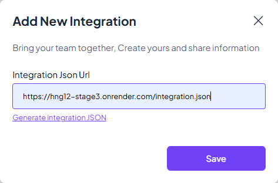
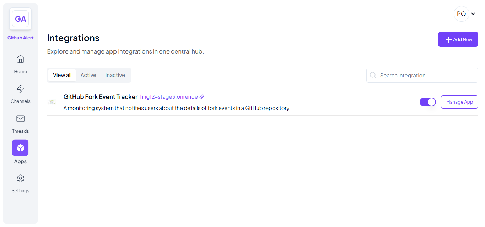
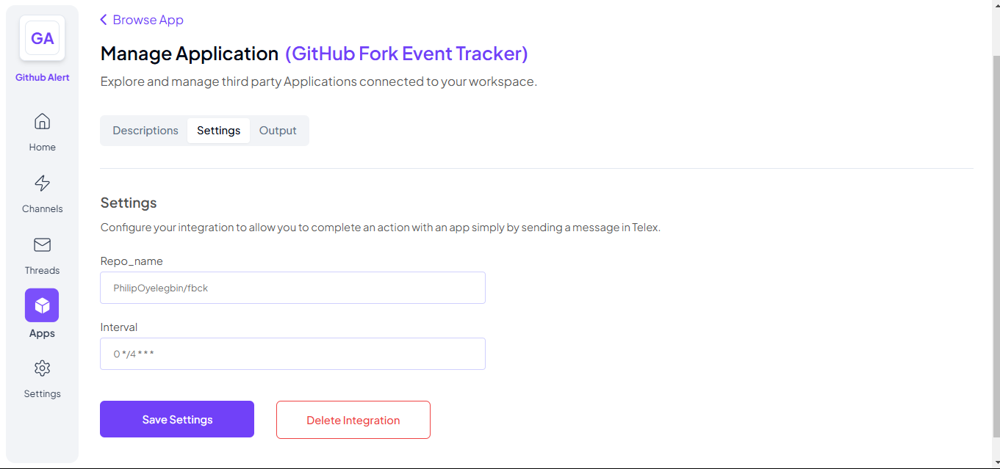
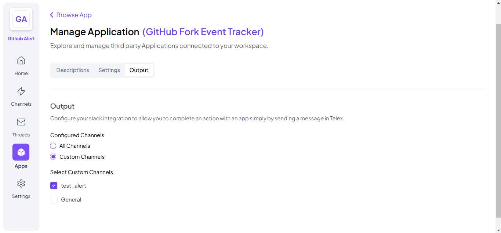
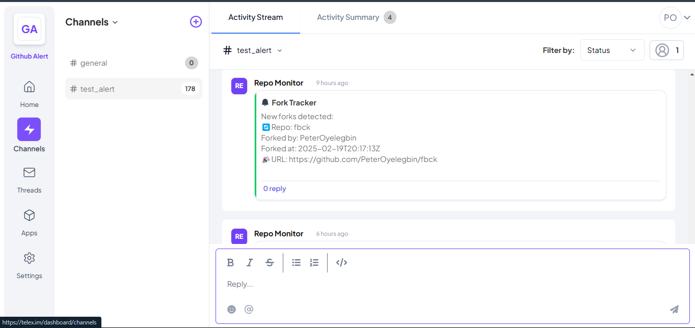

# GitHub Fork Event Tracker with Telex Integration
This project is a FastAPI-based application that monitors a GitHub repository for fork events and sends notifications with details of the fork event to a Telex channel. It is designed to help you stay informed about when and by whom your repository is forked.

---

## Features
- Real-time Monitoring: Automatically detects fork events on a specified GitHub repository.
- Telex Notifications: Sends detailed notifications to a Telex channel, including the forker's username, repository name, and the timestamp of the fork event.
- Easy Integration: Built with FastAPI, making it lightweight, fast, and easy to integrate into your existing systems.
- Asynchronous HTTP requests using httpx

---

## Technology Stack
- **FastAPI** (Web framework)
- **httpx** (Async HTTP requests)
- **Uvicorn** (ASGI server for FastAPI)
- **GitHub API** (Access to GitHub Repository)

---

## Prerequisites
Before you begin, ensure you have the following:
- Python 3.7 or higher installed.
- A GitHub repository to monitor.
- A Telex return url and channel ID for sending notifications.
- (Optional) Docker for containerized deployment.

---

## Installation
1. **Clone the repository:**
   ```bash
   git clone https://github.com/telexintegrations/github-fork-tracker.git
   cd github-fork-tracker
   ```
2. **Create a virtual environment and activate it:**
   ```bash
   python -m venv venv
   source venv/bin/activate  # On Windows use: venv\Scripts\activate
   ```
3. **Install dependencies:**
   ```bash
   pip install -r requirements.txt
   ```

---

## Running the API Locally
1. **Start the FastAPI server:**
   ```bash
   uvicorn main:app --host 0.0.0.0 --port 8000 --reload
   ```
2. **Access the API documentation:**
   - Open [http://127.0.0.1:8000/docs](http://127.0.0.1:8000/docs) for an interactive Swagger UI.

---

## API Endpoints
- **Endpoint:** `POST /tick`
- **Example Request:**
   ```bash
   curl --location 'http://127.0.0.1:8000/tick' \
   --header 'Content-Type: application/json' \
   --data '{
      "channel_id": "<your-test-telex-channel-id>",
      "return_url": "https://ping.telex.im/v1/return/<your-test-telex-channel-id>",
      "settings": [
         {
               "label": "repo_name",
               "type": "text",
               "required": true,
               "default": "github_username/repo"
         },
      ]
   }'
   ```

---

## Usage
- Ensure the application is hosted and running on a publicly accessed server.
- Login to your telex app
- Navigate to the `Channels` tab, and add a new channel specifically for monitoring
- Navigate to the `Apps` tab, and add new integration
   - Add your integration.json enpoint to the `Integration Json Url` field and save as shown below;
     
   - Toggle to enable/activate integration as shown below;
     
   - Click `Manage App` and navigate to the `Settings` tab to configure your integration as shown below;
     * Add `github_username/repo` to `Repo_name` field
     * Set the interval to triger request every 4 hours `0 */4 * * *` or as needed. 
     
     * Navigate to `Output` tab, and select `Custom channel`, selecting your previously created monitoring channel as shown below;
     
     * Check your telex monitoring channel for the notification
     

---

## Contributing
Contributions are welcome! Please feel free to submit a pull request or open an issue if you have any suggestions or improvements.

---

## License
This project is licensed under the MIT License. See the LICENSE file for details.

---

## Acknowledgments
- FastAPI for the web framework.
- GitHub API for repository event monitoring.
- Telex channel for sending notifications.
